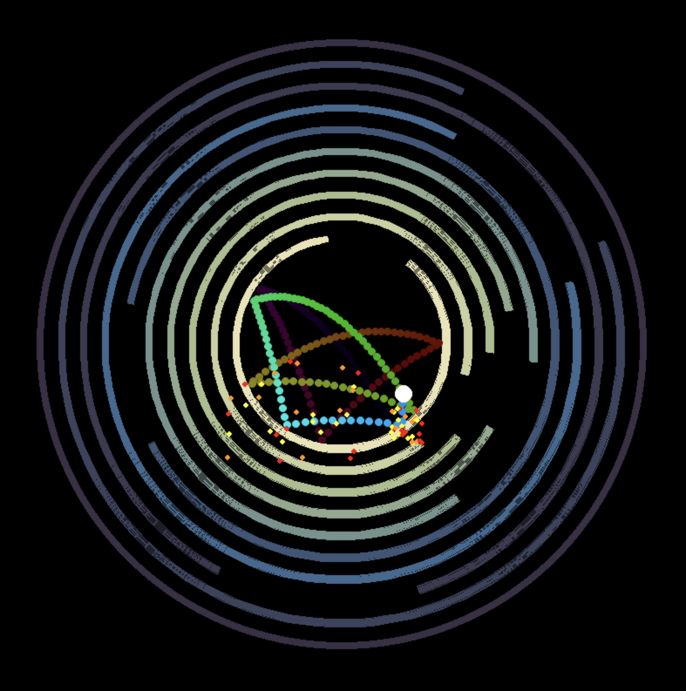
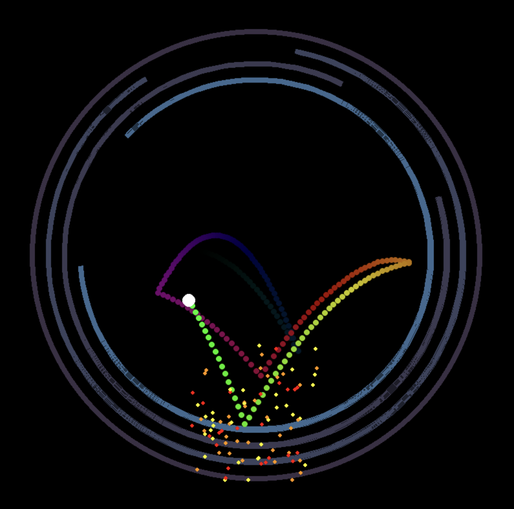

# The Bouncing Ball Game

## Controls

- `↑` — Speed UP on the next collision.
- `↓` — Speed DOWN on the next collision.
- `SPACE` — Pause.

## Installation

```bash
python3 -m venv .venv
. .venv/bin/activate
poetry install --no-root
```

## Running

```bash
python3 main.py
```

## Screenshots





https://github.com/user-attachments/assets/8d5a3136-fa49-41af-b9dc-04d29318e622
